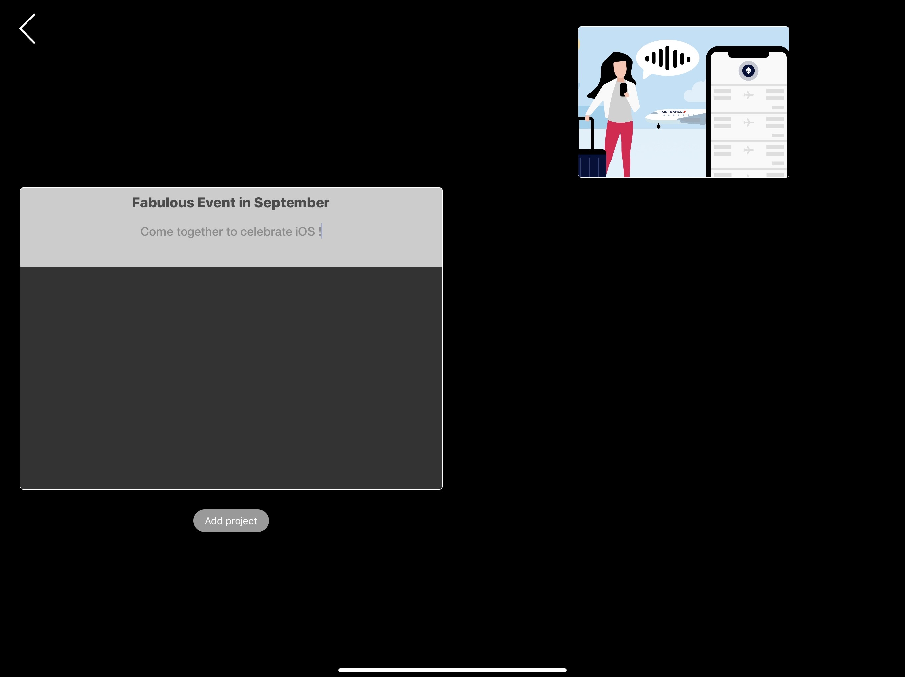
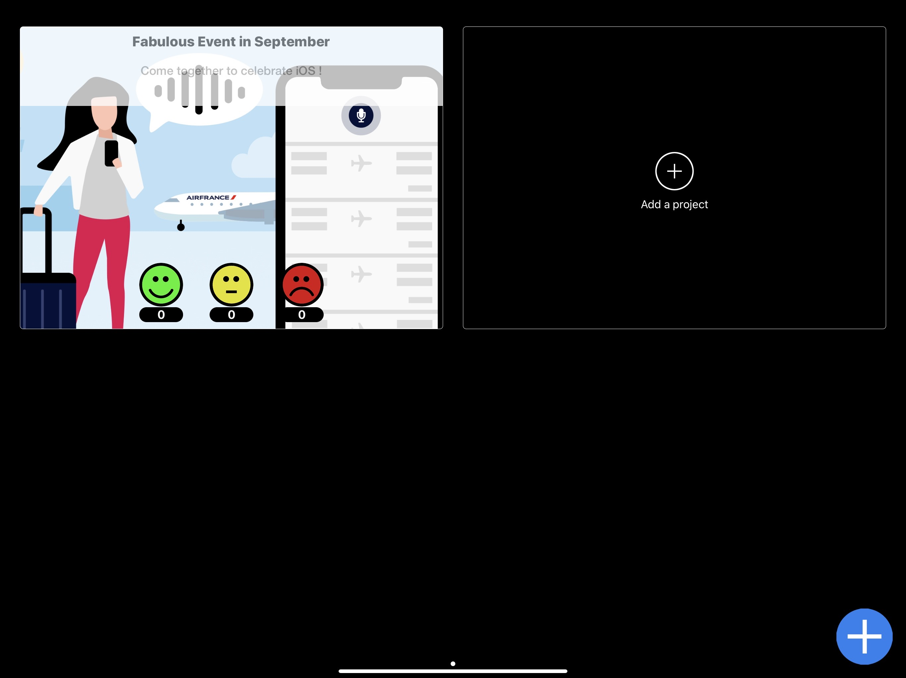
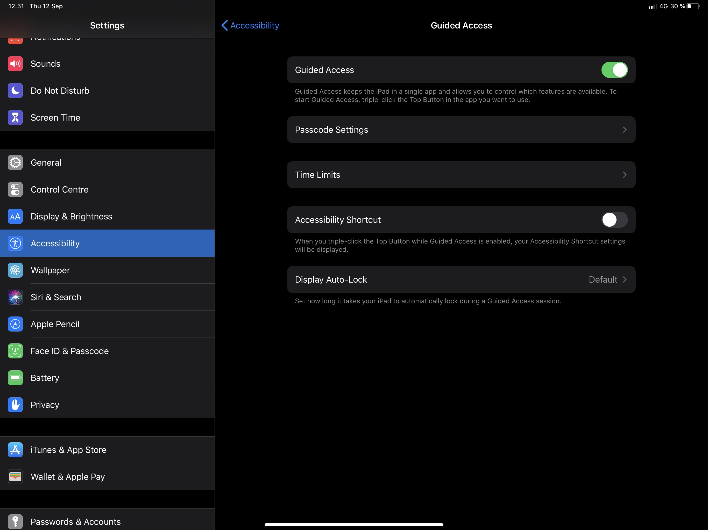

# AppFeedback

   

AppFeedback makes it easy to collect feedbacks from people who have attended a presentation or a product demo, or who have tested a new application or a service.

1. [Why use the AppFeedback?](#why-use-the-appfeedback)
2. [Requirements](#requirements)
3. [Usage](#usage)
   - [Project configuration](#project-configuration)
   - [Initialization](#initialization)
4. [v1.0.x](#v1.0.x)
   
 

## Why use the AppFeedback?
---

Feedback app is a great simple app to get quick feedback from your attendees when you host an event.
Give an ipad in "guided access" to prevent them to do anything but give their appreciation for the event they attend.
Off course, try to get the iPad at the end !

 

## Requirements
----

- iOS 11.0+
- Swift 

 

## Usage
---

1. Launch the app, you get an empty space and just add to click on + button to define Event
2. 
3. Select image or video you have already uploaded in the File section dedicated to this app
4. 
5. 
6. Give Event name and description and you're ok to go throught Guided Access setting
7. Go to the General Settings of the iPad, then activate the Guided access, define a password to unlock guided access
8.  

 

#### Project configuration

 

#### Initialization

 

## v1.0.x
---

